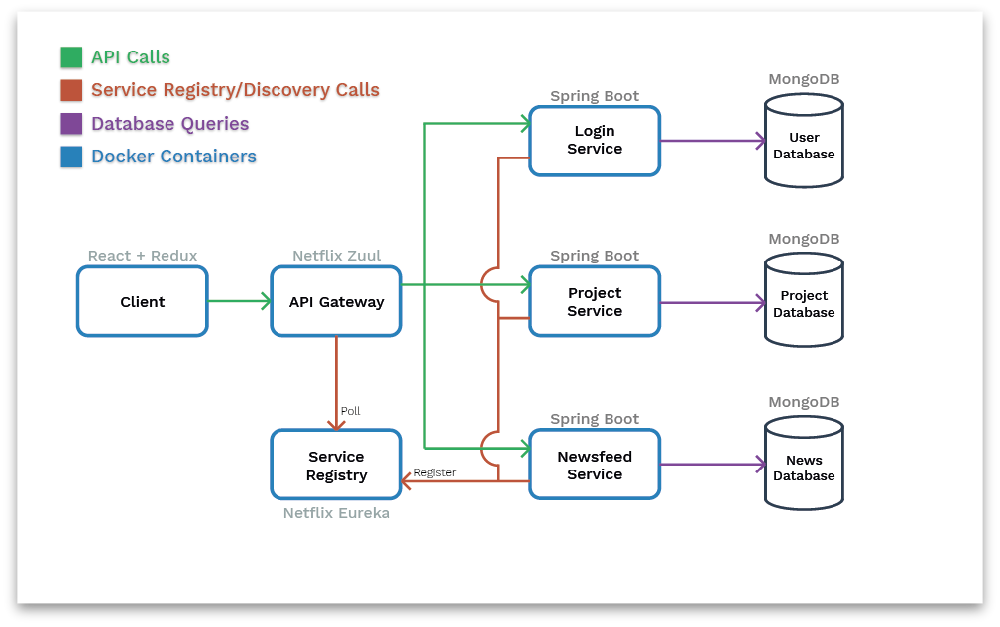
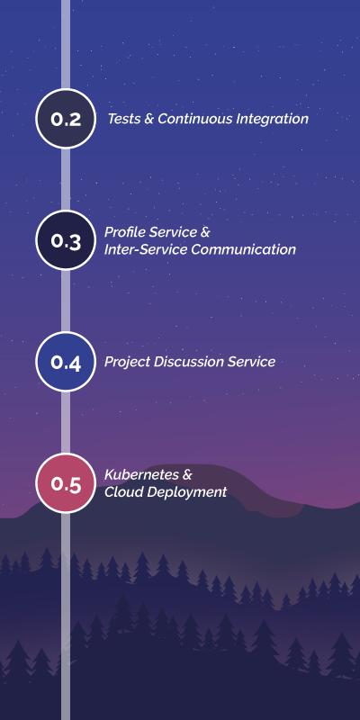

# Astra | Collaborative Project Management

**Astra** is a collaborative project management tool where users can define projects, as
well as tasks and subtasks, which allow users to track their progress. Projects can also
be shared with other memebers, allowing for collaborative project management across teams.

Sling is built on an underlying microservices architecture.
For technical speficiations, see the [Built With](#built-with) section.

## Getting Started

These instructions will get you a copy of the project up and running on your
local machine for development and testing purposes.

### Prerequisites

Astra is fully containerized using Docker and docker-compose, which means that
the following requirements are the only ones needed in order to build the project:

```
Docker 18.0+
Docker-Compose 1.23+
```

### Building & Running the Project

Due to Astra's containerization, building and running the project is as simple as
executing the following command:

```
docker-compose up --build
```

## Running the tests

Back-end tests are managed using Maven.

You can run unit tests with the following command:

```
mvn test
```

Similarly, integration tests are run using:

```
mvn verify
```

Front-end tests are managed using npm, and can be run using:

```
npm test
```

## Built With

As a general overview, the system follows a microservices architecture. All services
are containerized in order to ensure that the application runs quickly and reliably
from one computing environment to another.



The following tools and frameworks are used in this project:

### Front-end

- [React](https://reactjs.org) - Front-end Framework
- [Redux](https://redux.js.org) - Application State Management
- [Semantic UI React](https://react.semantic-ui.com) Styled Components

### Back-end

- [Java Spring Suite](https://spring.io) - Backend Services
  - [Netflix Zuul](https://github.com/Netflix/zuul) - API Gateway
  - [Netflix Eureka](https://github.com/Netflix/eureka) - Service Discovery
  - [Spring Security](https://spring.io/projects/spring-security) - Authentication & Authorization
  - [Spring Data](https://spring.io/projects/spring-data) - Database Access
- [Maven](https://maven.apache.org/) - Dependency Management & Build Tool

### Data Storage

- [MongoDB](https://www.mongodb.com) - Data Storage
  - [MongoDB Atlas](https://www.mongodb.com/cloud/atlas) - Hosted Databases

### Additional Tools and Frameworks

- [Docker](https://www.docker.com) - Service Containerization
- [Docker-Compose](https://docs.docker.com/compose/) - Running Multi-Container Docker Applications

## Roadmap & Upcoming Content



## Contributing

Please read [CONTRIBUTING.md](CONTRIBUTING.md) for details on the process for submitting pull requests to this project.

## Authors

### 0.2.0+

- **Erik Andersson** - _erik.osc.andersson@gmail.com_

### 0.1.0

- **Erik Andersson** - _erik.osc.andersson@gmail.com_
- **Elin Larsson** - _elila927@student.liu.se_

## License

This project is currently not under any license

## Acknowledgments

This project started as part of the course TDDD27 - Advanced Web
Programming at Linköping University. So a big thanks is due to all
TDDD27 course assistants!
